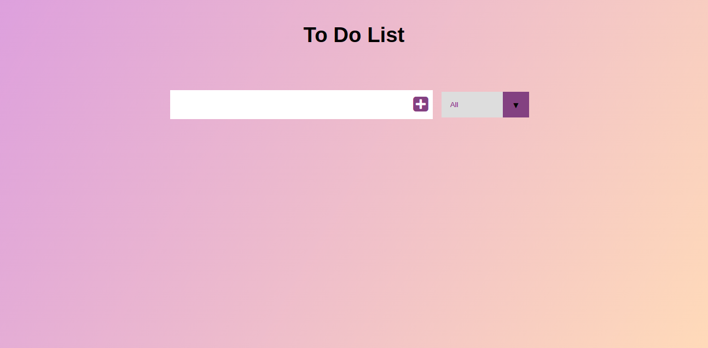

# to-do-list
This is a solo project that entails building a to do list with Javascript and Webpack



## Built With
- JavaScript
- Webpack
- HTML5
- CSS3

## Live Demo
- [Live Demo Link]()


## Getting Started

**simple steps set up on your local machine**

```
- $ git clone `$ git clone git@github.com:JulianaOsemeke/to-do-list.git`
- $ `cd to-do-list`
- $ npm install --save-dev webpack

```

## Author

👤 **Juliana Osemeke**

- GitHub: [@JulianaOsemeke](https://github.com/JulianaOsemeke)
- LinkedIn: [@juliana-osemeke](https://www.linkedin.com/in/juliana-osemeke/)
- Twitter: [@JulianaOsemeke](https://twitter.com/JulianaOsemeke)
